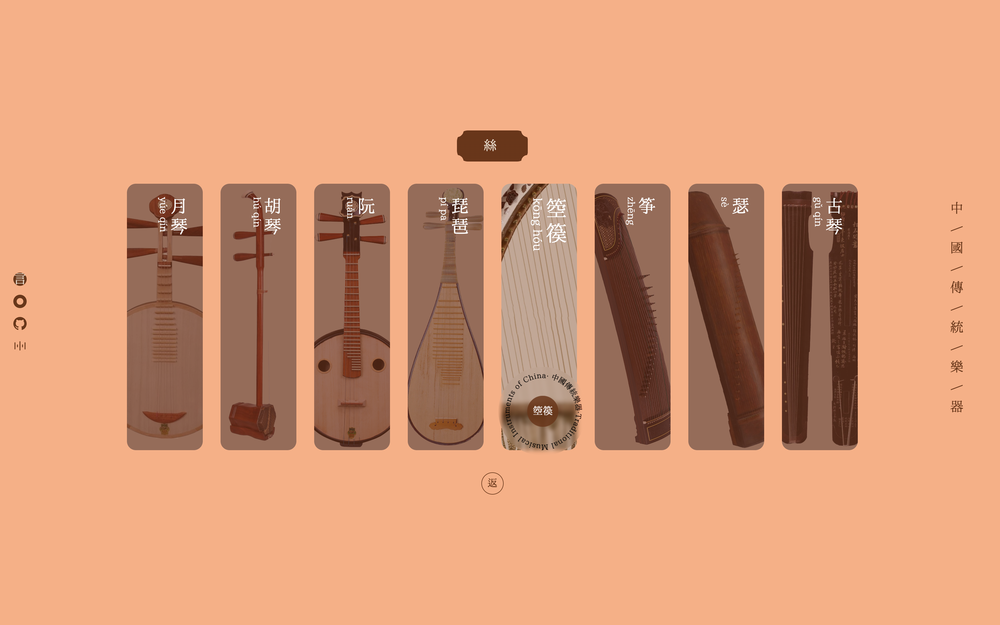

# TraditionalMusicalInstruments

中国传统乐器·Traditional Chinese musical instruments

vue3 + vite + typescript
```bash
git clone https://github.com/kansini/TraditionalMusicalInstruments.git
yarn install
yarn dev
```
## Project preview




